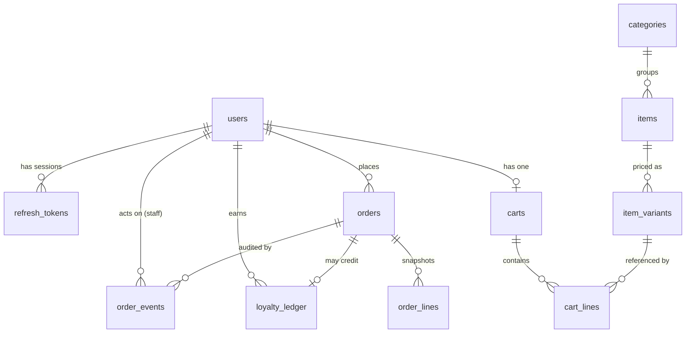

# Coffee Mug Shop — Database Schema

**Status:** This describes the **live schema** defined in `migrations/0001_init.up.sql`, already applied and seeded in the running system. It is a description of what exists, not a proposal.
**Engine:** PostgreSQL 16. **Money:** every monetary column is `BIGINT` in **pesewas** (1 GHS = 100 pesewas); no floating point anywhere.
**Version:** 1.0

---

## 1. Entity-relationship overview

Eleven tables in four groups: **identity** (`users`, `refresh_tokens`), **catalog** (`categories`, `items`, `item_variants`), **cart** (`carts`, `cart_lines`), and **orders + ledger** (`orders`, `order_lines`, `order_events`, `loyalty_ledger`).

All primary keys are `BIGINT GENERATED ALWAYS AS IDENTITY`. All timestamps are `TIMESTAMPTZ DEFAULT now()`.

---

## 2. Identity

### `users`
The account record for all three roles.

| Column | Type | Constraints | Notes |
|---|---|---|---|
| `id` | BIGINT | PK | |
| `name` | TEXT | NOT NULL | |
| `email` | TEXT | NOT NULL, **UNIQUE** | login identifier |
| `phone` | TEXT | NOT NULL DEFAULT '' | |
| `password_hash` | TEXT | NOT NULL | bcrypt, cost 12 — never the plaintext |
| `role` | TEXT | NOT NULL DEFAULT 'customer', **CHECK** in ('customer','staff','admin') | authorization is driven by this column |
| `created_at` | TIMESTAMPTZ | NOT NULL DEFAULT now() | |

The `CHECK` on `role` means an invalid role cannot exist in the table even if application code has a bug.

### `refresh_tokens`
One row per active long-lived session.

| Column | Type | Constraints | Notes |
|---|---|---|---|
| `id` | BIGINT | PK | |
| `user_id` | BIGINT | NOT NULL, FK → users **ON DELETE CASCADE** | |
| `token_hash` | TEXT | NOT NULL, **UNIQUE** | **SHA-256 of the token**, never the token itself |
| `expires_at` | TIMESTAMPTZ | NOT NULL | |
| `created_at` | TIMESTAMPTZ | NOT NULL DEFAULT now() | |

Design decision: storing only the hash means a database leak does not hand an attacker usable sessions. Rotation is implemented in application logic by deleting the row on use and inserting a new one.

---

## 3. Catalog

### `categories`
| Column | Type | Constraints |
|---|---|---|
| `id` | BIGINT | PK |
| `name` | TEXT | NOT NULL, UNIQUE |
| `sort_order` | INT | NOT NULL DEFAULT 0 |

### `items`
| Column | Type | Constraints | Notes |
|---|---|---|---|
| `id` | BIGINT | PK | |
| `category_id` | BIGINT | NOT NULL, FK → categories | |
| `name` | TEXT | NOT NULL | |
| `description` | TEXT | NOT NULL DEFAULT '' | |
| `image_url` | TEXT | NOT NULL DEFAULT '' | |
| `is_available` | BOOLEAN | NOT NULL DEFAULT TRUE | the "sold out" toggle; filtered in customer queries |
| `created_at` | TIMESTAMPTZ | NOT NULL DEFAULT now() | |

### `item_variants`
A purchasable size/option of an item. **Price lives here, not on `items`** — a "Latte" has no single price; "Latte / Large" does.

| Column | Type | Constraints | Notes |
|---|---|---|---|
| `id` | BIGINT | PK | this is the ID the cart and ordering reference |
| `item_id` | BIGINT | NOT NULL, FK → items **ON DELETE CASCADE** | |
| `name` | TEXT | NOT NULL | e.g. "Small", "Large", "Double" |
| `price_pesewas` | BIGINT | NOT NULL, **CHECK (>= 0)** | the actual price |
| `sort_order` | INT | NOT NULL DEFAULT 0 | |

---

## 4. Cart

### `carts`
| Column | Type | Constraints | Notes |
|---|---|---|---|
| `id` | BIGINT | PK | |
| `user_id` | BIGINT | NOT NULL, **UNIQUE**, FK → users ON DELETE CASCADE | one cart per user, enforced by the UNIQUE constraint |

### `cart_lines`
| Column | Type | Constraints | Notes |
|---|---|---|---|
| `id` | BIGINT | PK | |
| `cart_id` | BIGINT | NOT NULL, FK → carts ON DELETE CASCADE | |
| `item_variant_id` | BIGINT | NOT NULL, FK → item_variants ON DELETE CASCADE | |
| `quantity` | INT | NOT NULL, **CHECK (> 0)** | |
| | | **UNIQUE (cart_id, item_variant_id)** | the same variant cannot appear twice; adding again increments quantity |

The cart stores **no price**. Prices are resolved by joining to `item_variants` at read and checkout time, so the cart is always priced against the live menu and can never hold a stale figure.

---

## 5. Orders and ledger

### `orders`
The order header.

| Column | Type | Constraints | Notes |
|---|---|---|---|
| `id` | BIGINT | PK | |
| `user_id` | BIGINT | NOT NULL, FK → users | |
| `status` | TEXT | NOT NULL DEFAULT 'pending_payment', **CHECK** in the 7 lifecycle states | see §6 |
| `fulfilment` | TEXT | NOT NULL, **CHECK** in ('pickup','delivery') | drives which transitions are legal |
| `address` | TEXT | NOT NULL DEFAULT '' | required only for delivery (enforced in app) |
| `phone` | TEXT | NOT NULL DEFAULT '' | |
| `subtotal_pesewas` | BIGINT | NOT NULL | sum of line totals |
| `delivery_fee_pesewas` | BIGINT | NOT NULL DEFAULT 0 | flat fee, only for delivery |
| `discount_pesewas` | BIGINT | NOT NULL DEFAULT 0 | reserved for loyalty redemption (not yet applied) |
| `total_pesewas` | BIGINT | NOT NULL | the amount sent to and verified against Paystack |
| `paystack_reference` | TEXT | **UNIQUE** | the idempotency anchor for the payment webhook |
| `idempotency_key` | TEXT | **UNIQUE** | client-supplied; prevents duplicate checkout |
| `created_at` | TIMESTAMPTZ | NOT NULL DEFAULT now() | |

Indexes: `idx_orders_status` (powers the staff queue) and `idx_orders_user` (powers customer history).

Two `UNIQUE` columns do real work here: `paystack_reference` makes webhook processing idempotent at the database level, and `idempotency_key` makes checkout idempotent.

### `order_lines`
The **immutable snapshot** of what was bought. This is the single most important modelling decision in the schema.

| Column | Type | Constraints | Notes |
|---|---|---|---|
| `id` | BIGINT | PK | |
| `order_id` | BIGINT | NOT NULL, FK → orders ON DELETE CASCADE | |
| `item_name` | TEXT | NOT NULL | **copied** at checkout, not a foreign key |
| `variant_name` | TEXT | NOT NULL | **copied** at checkout |
| `unit_price_pesewas` | BIGINT | NOT NULL | **copied** at checkout |
| `quantity` | INT | NOT NULL | |

There is deliberately **no foreign key** to `item_variants`. The name and price are copied as plain text/integers so that renaming a drink, re-pricing it, or deleting it entirely never alters the historical record of an order that already happened. A receipt from last week must still read the same next year.

### `order_events`
The audit trail of the state machine.

| Column | Type | Constraints | Notes |
|---|---|---|---|
| `id` | BIGINT | PK | |
| `order_id` | BIGINT | NOT NULL, FK → orders ON DELETE CASCADE | |
| `from_status` | TEXT | NOT NULL | |
| `to_status` | TEXT | NOT NULL | |
| `actor_id` | BIGINT | FK → users (nullable) | the staff member; **NULL when the actor is the system** (the payment webhook) |
| `created_at` | TIMESTAMPTZ | NOT NULL DEFAULT now() | |

### `loyalty_ledger`
Phase 2. An **append-only** ledger; there is no balance column anywhere.

| Column | Type | Constraints | Notes |
|---|---|---|---|
| `id` | BIGINT | PK | |
| `user_id` | BIGINT | NOT NULL, FK → users | |
| `order_id` | BIGINT | FK → orders (nullable) | the order that caused the entry |
| `delta` | BIGINT | NOT NULL | **positive** = earned, **negative** = redeemed |
| `reason` | TEXT | NOT NULL | e.g. `earn_on_completion` |
| `created_at` | TIMESTAMPTZ | NOT NULL DEFAULT now() | |

Balance is computed as `SELECT SUM(delta) WHERE user_id = ?`. Because the balance is never stored, it can never disagree with its own history — a class of bug (the cached balance drifting away from the transactions) is designed out of existence rather than guarded against. The negative-delta redemption rows are written by the **redemption feature that is not yet built** (the developer's reserved task); the column and the sign convention already accommodate it.

---

## 6. The order status field in detail

`orders.status` is constrained by `CHECK` to exactly these seven values:

`pending_payment` · `paid` · `preparing` · `ready` · `out_for_delivery` · `completed` · `cancelled`

The database guarantees the value is one of these. The **application's domain layer** guarantees the *transitions* between them are legal and fulfilment-aware — the database does not encode the transition graph, because a `CHECK` cannot see the previous value. The two layers split the work: the column type is protected by Postgres, the lifecycle is protected by `internal/domain`. (Full transition graph is in the TRD §6 and the User Journey §4.)

---

## 7. Migration files

- `migrations/0001_init.up.sql` — creates all eleven tables, the two order indexes, and all constraints above.
- `migrations/0001_init.down.sql` — drops all tables in dependency order for a clean teardown.
- `seed.sql` — a realistic eight-item Ghanaian coffee-shop menu with fourteen variants, all priced in pesewas, for demonstration.

Run order: `make migrate-up` then `make seed`. The seed step also provisions an admin and a staff account via the `seeduser` helper.
